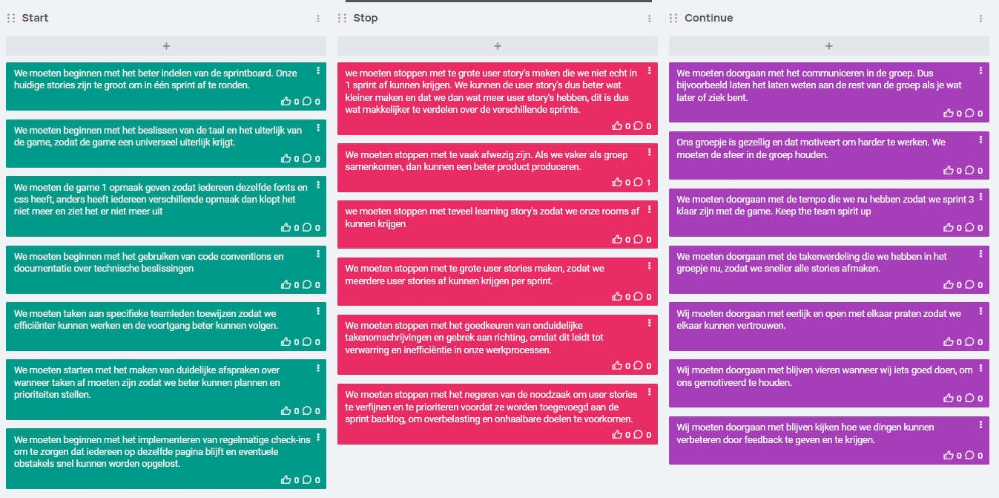

**Retro sprint 1 blok 3**

Nu sprint 1 is afgerond, kijken we terug op afgelopen sprint aan de hand van de startstopcontinue retro methode. Hier Kijken we naar wat we vanaf nu moeten gaan doen, waar we mee moeten stoppen en waar we mee door moeten gaan.

**Reflectie van Eduard Ohanian op Sprint 1 - 15 maart 2024**

Als Eduard Ohanian kijk ik terug op Sprint 1 met een mix van tevredenheid en een sterke drang naar verdere groei als professionele ontwikkelaar. Deze sprint heeft niet alleen mijn technische vaardigheden versterkt, maar heeft ook mijn visie op mijn toekomstige loopbaan als ondernemer en ontwikkelaar verduidelijkt.

Wat ging goed:

Teamcohesie: Onze teamdynamiek was opmerkelijk tijdens Sprint 1. We communiceerden effectief en hielden regelmatig stand-ups om de voortgang te bespreken, wat resulteerde in een naadloze samenwerking en het behalen van gestelde doelen.
Effectieve planning: De planning die we opgesteld hadden, werd nauwgezet gevolgd, waardoor we binnen de gestelde tijdlijnen bleven en onze doelstellingen behaalden.
Kwaliteit van resultaten: Trots kunnen we zeggen dat ons eindproduct van hoge kwaliteit was en voldeed aan de verwachtingen van het project.
Wat ging minder goed:

Persoonlijke uitdagingen: Voor mij was de individuele opdracht uitdagend, vooral het implementeren van de edit- en delete-functionaliteiten kostte meer inspanning dan ik had verwacht.
Nieuwe terreinen: Het toepassen van literatuur in mijn werk bleek een uitdaging te zijn, aangezien dit een nieuw terrein voor mij was en ik meer tijd nodig had om dit goed te begrijpen en toe te passen.
Actiepunten:

Verdere verdieping in mijn programmeervaardigheden, met name in Object-Oriented Programming (OOP) en TypeScript.
Streven naar een diepgaand begrip van OOP, zodat ik niet alleen effectief kan coderen, maar ook anderen kan onderwijzen en begeleiden in deze concepten.
Wat heb ik geleerd van deze sprint:

Een beter begrip van OOP en hoe dit toe te passen in mijn code.
Het belang van heldere communicatie binnen het team en hoe dit bijdraagt aan het succes van een project.
Het verdelen van taken op een efficiënte manier om de productiviteit te verhogen.
Conclusie:
Sprint 1 was een waardevolle ervaring waarin ik niet alleen technische vaardigheden heb ontwikkeld, maar ook mijn groei als professionele ontwikkelaar heb geëvalueerd. Ik ben tevreden met mijn vooruitgang, maar ik ben me ook bewust van de ruimte voor verbetering. Met vastberadenheid zal ik deze ervaringen en inzichten meenemen naar de volgende sprint, en uiteindelijk streven naar het opzetten van mijn eigen bedrijf als een competente en bedreven ontwikkelaar.

**Retro individu William Boutros sprint 1**

In dit verslag reflecteer ik op mijn ervaring en vooruitgang, doormiddel van een terugblik op afgelopen sprinten. Dit verslag is bedoeld om mijn professionele ontwikkeling te documenteren, hoe ik de komende weken te werk zal gaan. Dit wordt besproken aan de hand van de volgende onderwerpen:
1.	Wat is er goed gegaan
2.	Wat is er minder goed gegaan
3.	Welke acties ga ik ondernemen
4.	Hoe zie ik mijzelf ontwikkelen als professional

Punt 4 is toegevoegd aan de hand van feedback van de vorige retro. Hier zal ik bespreken waar ik nu sta en waar ik uiteindelijk heen wil gaan als professional.

Wat is er goed gegaan?

Aan het begin van sprint 1 zijn we direct gaan werken aan onze sprintboard. We wilden een duidelijke taakverdeling tussen de teamleden hebben, waardoor ik direct wist waar ik mee aan de slag kon gaan. Zoals sprint 0 was de sfeer goed en was de team gemotiveerd om een mooi product te maken. De volgende punten zijn naar mijn mening positief verlopen in sprint 1:
-	Algemene sfeer in de team, het is gezellig om samen te komen op locatie om samen te werken.
-	Eerlijkheid in de team, als iemand niet tevreden is, dan wordt er iets gezegd. Zo kunnen de andere teamleden daar op aanpassen.
-	Communicatie, meestal zijn we allemaal op locatie of zijn we bereikbaar via Teams.
-	Onderlinge ondersteuning, zoals sprint 0 springen we goed in als een teamlid hulp of advies nodig heeft.

Persoonlijk ben ik deze sprint blij met mijn aanwezigheid en voortgang op het gebied van het leren gebruiken van Typescript. Naast een afspraak bij de fysiotherapeut ben ik elke dag aanwezig geweest bij de les om met mijn team samen te werken. Verder ben ik door de tutorials van de game engine Typescript beter gaan snappen en kan ik nu meerdere functies creëren in onze game. Deze functies zijn: Een level aanmaken, items aanmaken, items oppakken en gebruiken en NPC’s aanmaken om mee te praten.

Wat is er minder goed gegaan?

Twee dingen waar ik volgende sprint aan moet werken zijn:
1.	Mijn User Stories kleiner maken, zodat ik ze binnen een sprint af kan maken.
2.	Ondanks dat mijn kennis op het gebied van Typescript is gegroeid, kon ik meer voortgang boeken met mijn level. Meer uren besteden aan programmeren dus. 

Ik had mijn level onderverdeeld in vier User Stories en allemaal op de sprint 1 planning gezet. Achteraf ben ik er achter gekomen dat ze te groot waren om in één sprint af te ronden, waardoor er meerdere User Stories niet zijn afgemaakt. Verder was ik meer bezig met tutorials kijken en artwork maken voor het spel, dan met werkelijk programmeren.

Welke acties ga ik ondernemen?

Ten eerste zal ik voortaan de zelfgemaakte User Stories kleiner maken, zodat ik deze sneller af kan krijgen. Zo krijg ik een realistische “workload”, die in één sprint afgemaakt kan worden. In plaats van “Maak een item en zorg ervoor dat je deze kan geven aan een NPC” zal ik de User Stories “Maak een item” en “zorg ervoor dat je deze item kan geven aan een NPC” aanmaken.
Ten tweede moet ik de artwork met rust laten en meer uren besteden aan programmeren. Na de taakverdeling van sprint 2 zal ik mijn prioriteit leggen bij het maken van een complete level. Dan kan ik me pas zorgen gaan maken over de opmaak/interface.

Hoe zie ik mijzelf ontwikkelen als professional

Om te beginnen zie ik mijzelf nog als een beginner programmeur. Ik ben trots op wat ik tot nu toe heb gemaakt, zoals Dokkie en CodeXChange. Maar hoe verder ik kom met het leren van Typescript, hoe meer ik ook er achter kom hoeveel er te leren valt. Wel begin ik de basics te snappen en kan ik een product in elkaar zetten. Verder begin ik ook beter in teamverband te werken aan de hand van werken in groepsverband en het gebruiken van scrumtechnieken. Elke dag doe ik nieuwe ervaring op en leer ik hoe ik bij projecten beter mijn taken kan indelen. Dit merk ik aan de hand van een stijgende productiviteit vergeleken met blok 1. Dit zal naar mijn mening goed van pas komen in het bedrijfsleven.

Graag zou ik later als professional veel kennis willen hebben van meerdere programmeertalen, zodat ik software kan gebruiken om de huidige technologie vooruit te brengen. Hierbij denk ik aan AI, wat straks de wereld van ICT zal veranderen. Je hebt Sora OpenAI, wat een tekst-naar-video model is. Recent is “Devin” gemaakt, de allereerste AI software engineer die volledig automatisch werkt. Het is nog wel een lange weg te gaan voordat ik hier arriveer, dus mijn prioriteit ligt voor nu bij het halen van mijn propedeuse.

